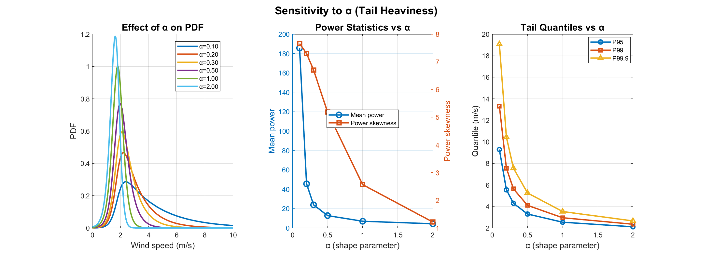
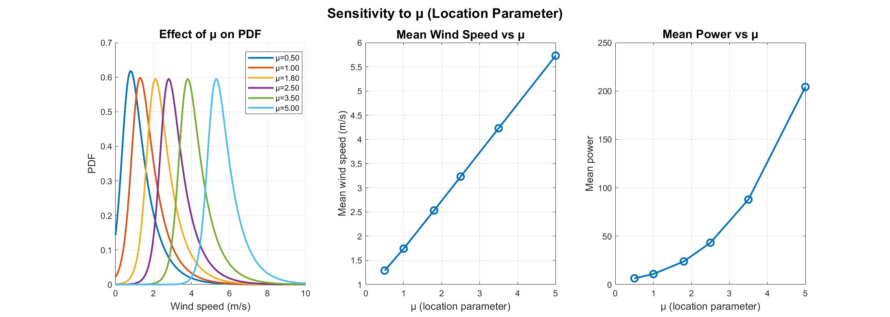
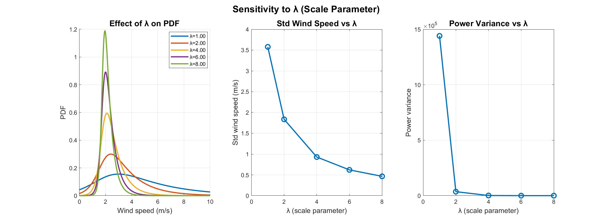

# TPHL Distribution: MATLAB Implementation

[](https://doi.org/10.34133/olar.0163)
[](https://spj.science.org/journal/olar)

This repository contains MATLAB code for the **Truncated Proportional Hazard Logistic (TPHL) distribution**, a physically consistent probabilistic framework for wind-speed modeling in coastal-inland regimes.

## Reference

**Wang, S., Cai, H., Wang, Y., Li, G., Jia, L., Wang, J., Zhao, T., & Lin, K.**  
*A Physically Consistent TPHL Distribution for Wind-Speed Modeling in Coastal–Inland Regimes.*  
**Ocean-Land-Atmosphere Research**, Article ID: 0163.  
DOI: [10.34133/olar.0163](https://doi.org/10.34133/olar.0163)  
Paper: [https://spj.science.org/doi/10.34133/olar.0163](https://spj.science.org/doi/10.34133/olar.0163)

## Overview

The TPHL distribution addresses limitations of the classical Weibull distribution by:
- Enforcing physical consistency (non-negative wind speeds)
- Providing independent control of location, scale, and tail behavior
- Enabling analytical computation of wind power statistics
- Capturing both sharp modal peaks and heavy tails simultaneously

### Key Features

- **Three-parameter model**: `α` (tail heaviness), `μ` (location), `λ` (scale)
- **Physical constraint**: Truncated at v ≥ 0
- **Analytical tractability**: Closed-form expressions for moments
- **Wind power statistics**: Direct computation from wind speed parameters

## File Structure

```
code/
├── README.md                          # This file
├── figures/                           # Sensitivity analysis figures
│   ├── sensitivity_alpha.png         # Sensitivity to α parameter
│   ├── sensitivity_mu.png            # Sensitivity to μ parameter
│   └── sensitivity_lambda.png        # Sensitivity to λ parameter
├── tphl_functions/                    # Core TPHL functions
│   ├── phl_pdf.m                     # PHL PDF (parent distribution)
│   ├── phl_survival.m                # PHL survival function
│   ├── tphl_pdf.m                    # TPHL PDF
│   ├── tphl_cdf.m                    # TPHL CDF
│   ├── tphl_quantile.m               # TPHL quantile function
│   ├── tphl_mle.m                    # Maximum likelihood estimation
│   ├── tphl_power_stats.m            # Wind power statistics
│   ├── tphl_ks_statistic.m           # Kolmogorov-Smirnov statistic
│   ├── tphl_aic.m                    # Akaike Information Criterion
│   └── tphl_bic.m                    # Bayesian Information Criterion
├── example_tphl_fitting.m             # Example: Fitting TPHL to data
└── parameter_sensitivity_analysis.m   # Parameter sensitivity analysis
```

## Quick Start

### 1. Add Function Path

```matlab
addpath('tphl_functions');
```

### 2. Basic Usage

```matlab
% Load wind speed data
% v = load('wind_data.mat', 'v');  % Load from file
% Or use your own data vector
v = v(v > 0.1);  % Remove very small values

% Fit TPHL distribution
seeds = [1.0, median(v), 0.6; 0.7, median(v), 0.3];
lb = [1e-4, -20, 1e-3];
ub = [50, 50, 10];
opts = statset('MaxIter', 1e4, 'Display', 'off');
[theta, loglik] = tphl_mle(v, seeds, lb, ub, opts);

alpha = theta(1);   % Tail heaviness parameter
mu = theta(2);      % Location parameter
lambda = theta(3);  % Scale parameter

% Compute PDF
v_plot = linspace(0, max(v)*1.2, 500);
pdf_vals = tphl_pdf(v_plot, alpha, mu, lambda);

% Compute wind power statistics
[meanP, varP, skewP, kurtP] = tphl_power_stats(alpha, mu, lambda, 1.0);
```

### 3. Run Examples

```matlab
% Example 1: Fit TPHL to data and compare with Weibull
run('example_tphl_fitting.m');

% Example 2: Parameter sensitivity analysis
run('parameter_sensitivity_analysis.m');
```

## Core Functions

### Distribution Functions

- **`tphl_pdf(v, alpha, mu, lambda, v0)`**: Probability density function
- **`tphl_cdf(v, alpha, mu, lambda, v0)`**: Cumulative distribution function
- **`tphl_quantile(q, alpha, mu, lambda, v0)`**: Quantile function
- **`tphl_random(alpha, mu, lambda, n, v0)`**: Random sample generation

### Parameter Estimation

- **`tphl_mle(data, seeds, lb, ub, options)`**: Maximum likelihood estimation with multi-start strategy

### Wind Power Statistics

- **`tphl_power_stats(alpha, mu, lambda, c, v0)`**: Compute mean, variance, skewness, and excess kurtosis of wind power (P = c·V³)

### Goodness-of-Fit

- **`tphl_ks_statistic(data, alpha, mu, lambda, v0)`**: Kolmogorov-Smirnov test statistic
- **`tphl_aic(data, alpha, mu, lambda, v0)`**: Akaike Information Criterion
- **`tphl_bic(data, alpha, mu, lambda, v0)`**: Bayesian Information Criterion

## Parameter Interpretation

### α (alpha) - Tail Heaviness
- **Small α** (0.1-0.5): Heavy tails, captures extreme winds
- **Large α** (>1.0): Lighter tails, more Gaussian-like
- **Typical range**: 0.2-0.5 for wind speed data



### μ (mu) - Location Parameter
- Characteristic wind speed level
- **Inland sites**: Lower μ (1.4-1.9 m/s)
- **Coastal sites**: Higher μ (2.4-3.0 m/s)



### λ (lambda) - Scale Parameter
- Controls distribution width
- **Large λ** (>3.0): Narrow, steady distributions (inland)
- **Small λ** (<2.0): Broad, variable distributions (coastal)



## Example: Comparison with Weibull

```matlab
% Fit both distributions
[theta_tphl, ~] = tphl_mle(v, seeds, lb, ub, opts);
pd_wb = fitdist(v, 'Weibull');

% Compute KS statistics
ks_tphl = tphl_ks_statistic(v, theta_tphl(1), theta_tphl(2), theta_tphl(3));
ks_wb = max(abs(ecdf(v) - cdf(pd_wb, sort(v))));

% Compare AIC
aic_tphl = tphl_aic(v, theta_tphl(1), theta_tphl(2), theta_tphl(3));
aic_wb = 2*2 - 2*sum(log(pdf(pd_wb, v) + eps));

fprintf('KS: TPHL=%.4f, Weibull=%.4f\n', ks_tphl, ks_wb);
fprintf('AIC: TPHL=%.2f, Weibull=%.2f\n', aic_tphl, aic_wb);
```

## Requirements

- MATLAB R2016b or later
- Statistics and Machine Learning Toolbox (for `mle`, `fitdist`, etc.)

## Citation

If you use this code in your research, please cite:

```bibtex
@article{wang2026tphl,
  title={A Physically Consistent TPHL Distribution for Wind-Speed Modeling in Coastal--Inland Regimes},
  author={Wang, Shuxian and Cai, Huayang and Wang, Yajun and Li, Gaojin and Jia, Liangwen and Wang, Jiuke and Zhao, Tongtiegang and Lin, Kairong},
  journal={Ocean-Land-Atmosphere Research},
  volume={0},
  pages={0163},
  year={2026},
  doi={10.34133/olar.0163},
  url={https://doi.org/10.34133/olar.0163}
}
```

## License

This code is provided as supplementary material for the published research paper. Please refer to the paper for theoretical details and validation results.

## Contact

For questions or issues, please contact:
- **Corresponding author**: caihy7@mail.sysu.edu.cn

## Acknowledgments

This work was supported by:
- Guangdong Basic and Applied Basic Research Foundation (Grant No. 2023B1515040028)
- National Natural Science Foundation of China (Grant No. 52279080, 42406159)
- Guangdong Provincial Outstanding Young Scientist Fund (Grant No. 2024B1515020107)
- Guangdong Provincial Department of Science and Technology (Grant No. 2019ZT08G090)

